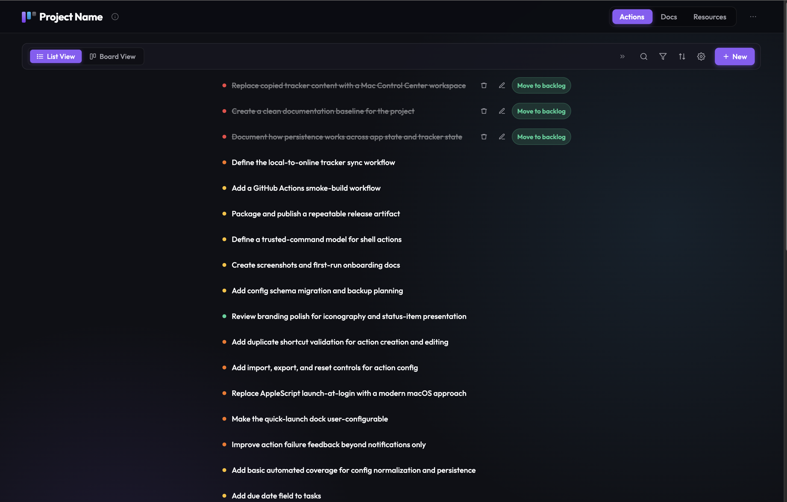

# Local Business Manager (LBM)

**LBM** is a free, open-source task and project tracker that runs in your web browser. No sign-up. No subscription. No internet connection needed. Download it once and it works.



---

## What Is It?

Think of it like a personal Notion or Trello — but it lives on your computer, not on someone else's server. You get:

- A **task list** to manage everything you're working on
- A **board view** (Kanban-style) to visualise your workflow
- A **docs hub** for keeping guides and notes alongside your tasks
- **Full ownership** of your data — it never leaves your machine

---

## Drop It Into Any Project

LBM is a folder. Copy it anywhere, name it, and you're running.

1. Copy the `1_LBM_Local_Business_Manager` folder into your project (or Desktop, or anywhere)
2. Open `data/project-data.js` and update the `name` and `fullName` fields
3. Open `index.html` in your browser
4. Click **ⓘ** in the header → **Reset to Seed**

Done. Your tracker is now configured for your project. The reset clears any leftover browser data from a previous project and loads cleanly from your seed file. An undo banner appears immediately so you can reverse it if needed.

> No account. No API key. No cloud service. The folder works on every machine, in every browser, offline.

---

## Install in 2 Minutes

Choose the path that fits you best.

---

### For Everyone (No Technical Skills Required)

**Step 1 — Download the project**

Go to the GitHub page for this project. Click the green **Code** button, then click **Download ZIP**.

> If you were sent a zip file directly, skip to Step 2.

**Step 2 — Unzip and move the folder**

Find the downloaded ZIP file (usually in your `Downloads` folder). Double-click it to unzip, then drag the folder to your Desktop or anywhere you like.

**Step 3 — Open the app**

Open the folder. Inside you will see a file called **`index.html`**. Double-click it.

```
📁 1_LBM_Local_Business_Manager
    └── 📄 index.html  ← double-click this
```

Your browser opens and the app loads instantly. Sample tasks are already there so you can see how everything works.

**That is it.** No installation. No account. Just open and use.

> **Having trouble with the Docs tab?** If the Docs section shows blank pages, you need to serve the folder through a simple local web server. See the [Troubleshooting](#troubleshooting) section below — it takes 30 seconds.

---

### For Developers

```bash
git clone <repo-url>
cd 1_LBM_Local_Business_Manager
open index.html
```

Or serve it locally to avoid CORS issues with the Docs tab:

```bash
python3 -m http.server 8080
# Then open http://localhost:8080
```

No npm. No build step. No dependencies. Just open the file.

---

## What You'll See

When you open the app for the first time, it comes pre-loaded with sample tasks so you can explore right away:

- **Actions tab** — your task list and board view
- **Docs tab** — all the guides for using and customising the app
- **Resources tab** — a place to keep links and reference material

---

## Making It Your Own

**Rename properties directly in the app** — click any property label (Urgency, Value, Area, etc.) in the task detail panel to rename it inline. The new name saves automatically and updates everywhere: the Sort menu, the Settings panel, and all views.

**Deeper customisation** lives in one file: [data/project-data.js](data/project-data.js)

Open it in any text editor (Notepad, TextEdit, VS Code — anything works) and update these fields:

```js
project: {
  name: "LBM",                        // ← short name shown in the header
  fullName: "Local Business Manager", // ← full name
  maintainedBy: "Your Name",          // ← your name
},
```

Save the file, refresh your browser. Done.

**Full customisation walkthrough:** [docs/SETUP_GUIDE.md](docs/SETUP_GUIDE.md)

---

## Your Data

Your tasks are saved automatically as you work. They are stored in your **browser's local storage** — on your computer, not in the cloud.

- **Closing the tab** is fine — your tasks are still there when you come back
- **Different browsers** have separate data — Chrome and Firefox won't share tasks
- **Clearing browser data** will erase your tasks — export first if needed

To back up your tasks: click the **ⓘ** icon in the app header and choose **Export JSON** or **Export Markdown**.

---

## Sharing With Your Team

LBM is designed to be handed to someone else with zero friction:

1. Make sure your tasks and settings are saved in `data/project-data.js`
2. Zip the folder and send it (or push to GitHub)
3. They open `index.html` — they're up and running immediately

New users always start from the tasks and configuration in `data/project-data.js`.

---

## Troubleshooting

| Problem | Fix |
|---|---|
| **Docs tab shows blank pages** | The browser is blocking local file reads. Open Terminal, run `cd` into the folder, then `python3 -m http.server 8080`, and visit `http://localhost:8080` |
| **My tasks disappeared** | Tasks live in your browser's local storage. Check that you're using the same browser and haven't cleared browsing data. |
| **The header shows the wrong project name** | Edit `data/project-data.js` and change the `name` and `fullName` fields, then refresh |
| **I want to start from a clean slate** | Click the **ⓘ** icon in the header and choose **Reset to Seed** — an undo banner appears immediately so you can restore if needed |

---

## Documentation

All guides are available inside the app under the **Docs** tab, and as plain files in the [docs/](docs/) folder.

| Guide | What it covers |
|---|---|
| [About](docs/ABOUT.md) | What LBM is, who it's for, and the vision behind it |
| [Setup Guide](docs/SETUP_GUIDE.md) | Step-by-step setup and customisation — developer and non-developer paths |
| [Vision and Philosophy](docs/VISION_AND_PHILOSOPHY.md) | The three-tier product roadmap and "everything in a box" philosophy |
| [Persistence and State](docs/PERSISTENCE_AND_STATE.md) | Where your data lives and how local storage works |
| [Keyboard Shortcuts](docs/KEYBOARD_SHORTCUTS.md) | All power-user shortcuts |
| [Local Project System](docs/LOCAL_PROJECT_SYSTEM.md) | How the tracker, docs, and seed data work together |
| [AI Development Guide](docs/AI_DEVELOPMENT_GUIDE.md) | Working with Claude Code to extend the app |

---

## For Developers — File Map

```
1_LBM_Local_Business_Manager/
├── index.html             ← main app (List + Board views)
├── docs.html              ← documentation viewer
├── resources.html         ← resource/asset index
├── styles.css             ← all styles (dark theme, design tokens)
├── task-app.js            ← list + board + detail panel logic
├── docs-app.js            ← docs viewer logic
├── header.js              ← shared header + nav
├── data/
│   ├── project-data.js    ← seed tasks, docs index, areas config
│   └── docs-content.js    ← pre-rendered doc cache (keep in sync!)
├── docs/                  ← documentation
│   ├── ABOUT.md               ← project overview
│   ├── SETUP_GUIDE.md         ← first-time user guide
│   ├── AI_DEVELOPMENT_GUIDE.md← working with Claude Code
│   ├── KEYBOARD_SHORTCUTS.md  ← all keyboard shortcuts
│   ├── PERSISTENCE_AND_STATE.md← where data lives
│   ├── LOCAL_PROJECT_SYSTEM.md ← tracker + docs workflow
│   └── VISION_AND_PHILOSOPHY.md← three-tier product vision
├── CLAUDE.md              ← AI session bootstrap (auto-loaded by Claude Code)
├── SKILL.md               ← feature development reference
├── SKILL_ADD_SHORTCUT.md  ← keyboard shortcut implementation guide
└── DESIGN_SKILL.md        ← CSS and UI design reference
```

**Key rules:**
- **Vanilla JS + HTML/CSS only** — no build step, no npm
- **Local-first** — all task state lives in `localStorage`; `data/project-data.js` is the git-tracked baseline
- **`docs-content.js` is a cache** — always update it when you change a `.md` doc file
- **Property labels sync everywhere** — `propLabels` in `localStorage` is the single source of truth; rename in the detail panel and it propagates to sort, settings, and all views automatically. Add new properties via `DEFAULT_PROP_LABELS` in `task-app.js`

**Adding features:** [SKILL.md](SKILL.md)  
**Design and CSS:** [DESIGN_SKILL.md](DESIGN_SKILL.md)  
**Working with Claude Code:** [docs/AI_DEVELOPMENT_GUIDE.md](docs/AI_DEVELOPMENT_GUIDE.md)

---

## The Vision

LBM is the free, open-source foundation of a three-part product vision:

| Tier | Name | Status |
|---|---|---|
| 1 | **LBM** — Local Business Manager | Free / Open Source |
| 2 | **OBM** — Online Business Manager | Freemium SaaS *(planned)* |
| 3 | **Business in a Box** | Premium agency rollout *(planned)* |

Read the full story: [docs/VISION_AND_PHILOSOPHY.md](docs/VISION_AND_PHILOSOPHY.md)
